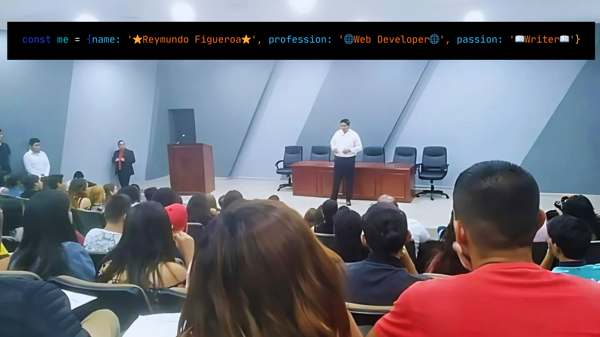

## Hi, I'm Reymundo 👋🧑‍💻

### Sobre Mí
Estoy en el último semestre de la carrera de Ingeniería en Sistemas, con un gran interés en el desarrollo front-end. Me apasiona crear interfaces de usuario atractivas y funcionales, y siempre estoy buscando aprender y mejorar mis habilidades.

### Habilidades Técnicas
- **Lenguajes**: HTML, CSS, JavaScript
- **Preprocesadores**: SASS
- **Herramientas**: NPM, GIT, GitHub

### Objetivos Profesionales
Mi objetivo a corto plazo es obtener una posición como desarrollador front-end en una empresa innovadora donde pueda aplicar y expandir mis habilidades. A largo plazo, aspiro a convertirme en un experto en accesibilidad web y contribuir a la creación de experiencias digitales inclusivas.

### Proyectos Destacados
- [Cenaduría Sara y Nando](https://github.com/reymundofigueroa/Cenaduria-Sara-y-Nando): Landing page para el restaurante "Cenaduría Sara y Nando".
- [Eco-Store](https://reymundofigueroa.github.io/Eco-store/): Landing page de una tienda de productos ecológicos .

### Educación y Certificaciones
- **Ingeniería en Sistemas**: Universidad UCAD (Último semestre)
- **Certificaciones**: Escuela HTML y CSS desde cero, Escuela Fundamentos de JavaScript en Platzi

### Intereses Personales
Además de mi pasión por la tecnología, tengo un profundo interés en las matemáticas, física, filosofía y psicología. Disfruto mucho escribir poemas e historias cortas, y he tenido la oportunidad de publicar un libro infantil.

### Aprendizaje en Comunidad
Me encanta aprender en comunidad y creo firmemente en el poder de la colaboración. Siento que tengo muy buenas habilidades blandas, lo que me permite comunicarme y trabajar eficazmente con otros.

### Enlaces
- [LinkedIn](https://www.linkedin.com/in/reymundo-fernando-figueroa-romo-35000b274/)
- [Facebook](https://www.facebook.com/reymundo.figueroa.3/)
- [Correo Electrónico](reymundo_124@hotmail.com)

---
<!--
**reymundofigueroa/reymundofigueroa** is a ✨ _special_ ✨ repository because its `README.md` (this file) appears on your GitHub profile.

Here are some ideas to get you started:

- 🔭 I’m currently working on ...
- 🌱 I’m currently learning ...
- 👯 I’m looking to collaborate on ...
- 🤔 I’m looking for help with ...
- 💬 Ask me about ...
- 📫 How to reach me: ...
- 😄 Pronouns: ...
- ⚡ Fun fact: ...
-->
